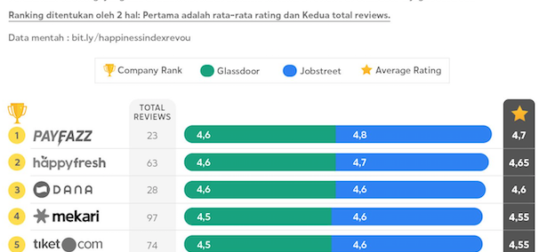
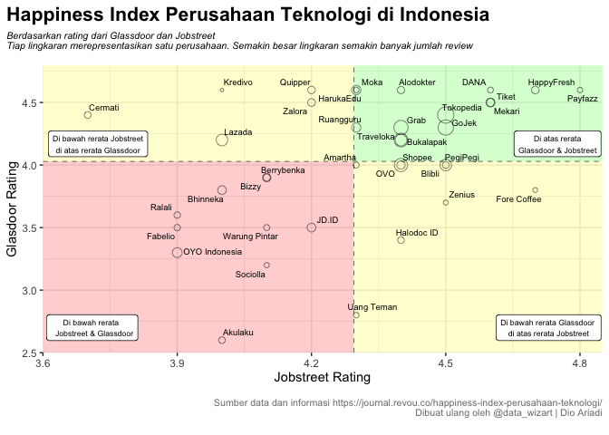

<center>


Full Image please visit
<https://journal.revou.co/happiness-index-perusahaan-teknologi/>
</center>

For a context this image was created by revoU to know which companies
have the highest rating for happiness index, the data comes from two
different source Jobstreet and Glassdoor. A full article can be read in
[here](https://journal.revou.co/happiness-index-perusahaan-teknologi/).

While the data is interesting in term visual it uses incorrect chart and
the goal here to suggest a possible way to show the data with different
chart, also provide the code so everyone can reproduce it.

What’s the problem with the chart?

The problem appeared when the chart that being used is stacked bar.
Index from two different data source should not be merged into single
bar. For example Jobstreet happiness rating on Dana vs Mekari it had
same value but since Glassdoor rating Dana is higher than Mekari it
seems Dana had a higher rating for Jobstreet if we ignore the label.
Above example means the x-axis for the chart would be double from
maximum five into 10.

What could be solution?

1.  If the goal is to show two different index then dumbbell chart could
    be solution. It shows the value for both Jobstreet and Glassdoor and
    keep the maximum index to five.

2.  From the data we know there are 2 index and also total review from
    both index, then we can use scatterplot

``` r
happiness_index <- read_csv("https://raw.githubusercontent.com/dioariadi/quick-analysis-datawizart/main/happiness_index_revou.csv")
```

    ## 
    ## ── Column specification ────────────────────────────────────────────────────────
    ## cols(
    ##   no = col_double(),
    ##   companies = col_character(),
    ##   linkedin_page = col_character(),
    ##   glassdoor_rating = col_double(),
    ##   jobstreet_rating = col_double(),
    ##   total_review_gd = col_double(),
    ##   total_review_js = col_double(),
    ##   total_review = col_double(),
    ##   avg_rating = col_double(),
    ##   categories = col_character(),
    ##   categories_group = col_character(),
    ##   funding = col_character(),
    ##   million = col_double()
    ## )

``` r
happiness_index <- happiness_index %>% mutate(companies = fct_reorder(companies,avg_rating,max))
# happiness_index <- happiness_index %>% mutate(label = ifelse(companies=="Payfazz","Avg<br>Rating",NA))
```

### Dumbbell Chart

Adding annotation for company that have same value for Jobstreet and
Glassdoor

``` r
final_plot <- ggplot()+
  ## start line
  geom_segment(data=happiness_index, aes(y=companies, yend=companies, x=2.5, xend=5.2), color="#b2b2b2", size=0.15) +
  geom_dumbbell(data = happiness_index, aes(y = companies,x=glassdoor_rating,xend=jobstreet_rating),
                colour_x = "#2FC1B9",colour_xend = "#197770",color="#e3e2e1", size=2) +
  geom_text(data = filter(happiness_index,companies=="Payfazz"),aes(y = companies,x=glassdoor_rating,label="Glassdoor"),
            vjust=-1.5,hjust=1.15,size=3,color="#2FC1B9") +
  geom_text(data = filter(happiness_index,companies=="Payfazz"),aes(y = companies,x=jobstreet_rating,label="JobStreet"),
            vjust=-1.5,hjust=-0.10,size=3,color="#197770") +
  geom_rect(data=happiness_index, aes(xmin=5.1,xmax=5.4,ymin=-Inf,ymax=Inf),fill="grey")+
  geom_rect(data=happiness_index, aes(xmin=5.45,xmax=5.75,ymin=-Inf,ymax=Inf),fill="grey")+
  geom_text(data=happiness_index, aes(y = companies,x=5.25,label=round(avg_rating,1)),size=3)+
  geom_text(data=happiness_index, aes(y = companies,x=5.6,label=total_review),size=3)+
  geom_text(data=filter(happiness_index,companies=="Payfazz"), aes(x=5.25,y=companies,label="Avg\nRating"),size=3.2,vjust=-0.52)+
  geom_text(data=filter(happiness_index,companies=="Payfazz"), aes(x=5.6,y=companies,label="Total\nReview"),size=3.2,vjust=-.52)+
  geom_text(data=happiness_index, aes(y=companies, x = glassdoor_rating, label=glassdoor_rating),vjust=2,size=2.5,color="#2FC1B9")+
  geom_text(data=happiness_index, aes(y=companies, x = jobstreet_rating, label=jobstreet_rating),vjust=2,size=2.5,color="#197770")+
  scale_x_continuous(expand=c(0,0), limits=c(2.5, 5.8))+
  scale_y_discrete(expand = c(0.05,0)) +
  theme_bw() +
  theme(
  panel.grid.major=element_line(colour = "white"),
  panel.grid.minor=element_blank(),
  panel.border=element_blank(),
  axis.ticks=element_blank(),
  axis.text.x=element_blank(),
  plot.title=element_text(size = 16, face="bold"),
  plot.title.position = "plot",
  plot.subtitle=element_text(face="italic", size=12, margin=margin(b=12)),
  plot.caption=element_text(size=8, margin=margin(t=12), color="#7a7d7e")
) +
  labs(title = "Happiness Index Perusahaan Teknologi",
       subtitle = "Ranking Perusahaan Teknologi Indonesia dengan
Pendaan Terbesar berdasarkan Rating Karyawan",
x = "Rating",
y=NULL,
caption = "Sumber data dan informasi https://journal.revou.co/happiness-index-perusahaan-teknologi/
Dibuat ulang oleh @data_wizart | Dio Ariadi")

final_plot +
  annotate("segment", x = 3.9, xend = 4.25, y = 23, yend = 23, colour = "grey", size=1, arrow=arrow(length = unit(2.5,"mm"),type = "closed"))+
  annotate(
    geom = "text", x = 3.7, y = 23,label="Glassdoor & Jobstreet\nmemiliki nilai sama",size=2.5)
```


### Scatterplot

``` r
scatter <- ggplot()+
  geom_rect(aes(xmin = 3.6,xmax = mean(happiness_index$jobstreet_rating),ymin=2.5,ymax=mean(happiness_index$glassdoor_rating)),fill="red",alpha=0.2)+
  geom_rect(aes(xmin = mean(happiness_index$jobstreet_rating),xmax = 4.85 ,ymin=2.5,ymax=mean(happiness_index$glassdoor_rating)),fill="yellow",alpha=0.2)+
  geom_rect(aes(xmin = 3.6,xmax = mean(happiness_index$jobstreet_rating),ymin=mean(happiness_index$glassdoor_rating),ymax=4.8),fill="yellow",alpha=0.2)+
  
  geom_rect(aes(xmin = mean(happiness_index$jobstreet_rating),xmax = 4.85 ,ymin=mean(happiness_index$glassdoor_rating),ymax=4.8),fill="green",alpha=0.2)+
  geom_point(data = happiness_index, aes(x = jobstreet_rating,y = glassdoor_rating,size=(total_review_gd+total_review_js)),
             alpha = 0.5,shape=1)+
  geom_text_repel(data=happiness_index,aes(x = jobstreet_rating,y = glassdoor_rating,label=companies),size=2.5,force =1,min.segment.length = 0.5)+
  geom_hline(yintercept = mean(happiness_index$glassdoor_rating),size=0.2,linetype="dashed")+
  geom_vline(xintercept = mean(happiness_index$jobstreet_rating),size=0.2,linetype="dashed")+
  # geom_text()
    theme_bw() +
  theme(
  # panel.grid.major=element_line(colour = "grey"),
  # panel.grid.minor=element_blank(),
  panel.border=element_blank(),
  # axis.ticks=element_blank(),
  # axis.text.x=element_blank(),
  plot.title=element_text(size = 16, face="bold"),
  plot.title.position = "plot",
  plot.subtitle=element_text(face="italic", size=8, margin=margin(b=12)),
  plot.caption=element_text(size=8, margin=margin(t=12), color="#7a7d7e"),
  legend.position = "none"
)+
  labs(x="Jobstreet Rating",
       y = "Glasdoor Rating",
       title = "Happiness Index Perusahaan Teknologi di Indonesia",
       subtitle = "Berdasarkan rating dari Glassdoor dan Jobstreet
Tiap lingkaran merepresentasikan satu perusahaan. Semakin besar lingkaran semakin banyak jumlah review",
       caption = "Sumber data dan informasi https://journal.revou.co/happiness-index-perusahaan-teknologi/
Dibuat ulang oleh @data_wizart | Dio Ariadi
")+
  geom_label(aes(x=3.71,y=2.7,label="Di bawah rerata 
  Jobstreet & Glassdoor"),size=2.3)+
  geom_label(aes(x=3.723,y=4.17,label="Di bawah rerata Jobstreet
di atas rerata Glassdoor"),size=2.3)+
  geom_label(aes(x=4.73,y=2.7,label="Di bawah rerata Glassdoor 
di atas rerata Jobstreet"),size=2.3)+
  geom_label(aes(x=4.75,y=4.17,label="Di atas rerata
Glassdoor & Jobstreet"),size=2.3)+
  scale_y_continuous(expand = c(0,0),limits = c(2.5,4.8))+
  scale_x_continuous(expand = c(0,0),limits = c(3.6,4.85))

scatter
```


